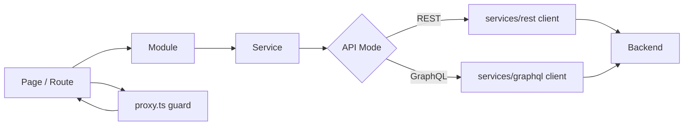

# Request Lifecycle

```mermaid
flowchart LR
  A[Page / Route] --> B[Module]
  B --> C[Service]
  C --> D{API Mode}
  D -->|REST| E[services/rest client]
  D -->|GraphQL| F[services/graphql client]
  E --> G[Backend]
  F --> G[Backend]
  A --> H[proxy.ts guard]
  H --> A
```

## Notes

- `proxy.ts` enforces route auth checks, RBAC, feature gates, and request-id propagation.
- Internal `app/api/*` handlers are reserved for auth/webhook concerns.
